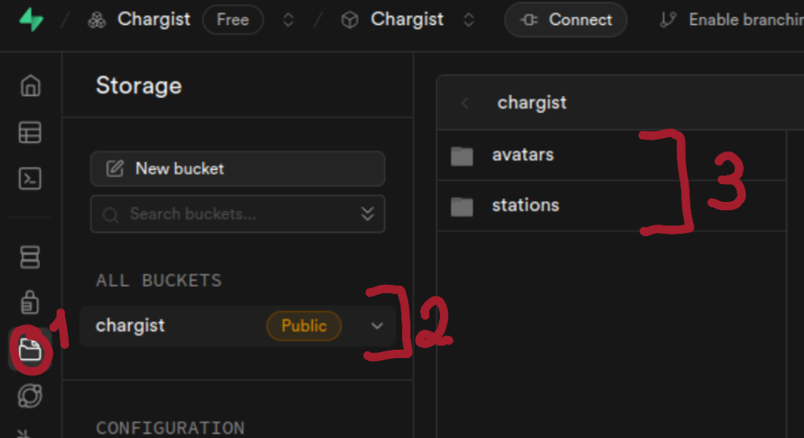

<div align="center">

<br>
<h1>CMU - 2024/2025</h1>
</div>

Project developed by:

**Group 02**: Daniela, Laura, Rodrigo

# Project
 ChargIST is a mobile application for Android, that explores several key aspects of mobile development, including location
 awareness, efficient use of limited resources, and social behavior. It provides mobile support for electric vehicles (EVs)
 and their owners, allowing users to find EV chargers in their surroundings, view information about the chargers and their
 capabilities, check their availability, and access additional information about nearby services such as air/water stations,
 restrooms, food options, and more
 
## Setup

To test the application, you need to:

- For the `comment translation` feature to work, a service called `libretranslate` must be running on the host machine. We’ve provided a `docker-compose` file for this. To start the service, simply run in the root of the project:
```bash
docker compose up
```
- After completing this, simply `open the project in an up-to-date version of Android Studio` by import this directory as a project in Android Studio.

- You are now ready to use all the features of the application normally.

___
The *database is already set up*. However, if you want to `configure your own API key`, follow these steps:
- Create an account on `Supabase`, set up a project, and update the API key in the `SupaClient.kt` file.
- Create a `bucket` in `Supabase` and add the folders "`avatars`" and "`stations`" to store user and station images, respectively, as shown in the image below:



- Copy the `SQL scripts` from the "`scripts_supabase`" folder (located in the root of the project) into the `Supabase SQL editor` and execute them, as shown in the image:

![]
(images/supa_scripts.png)


## Implemented features

We implemented all the mandatory features, as well as the following optional ones:
- User accounts
- User ratings
- Localization
